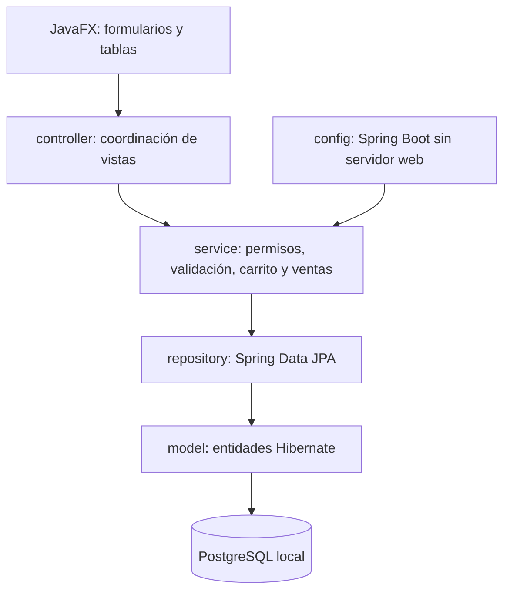
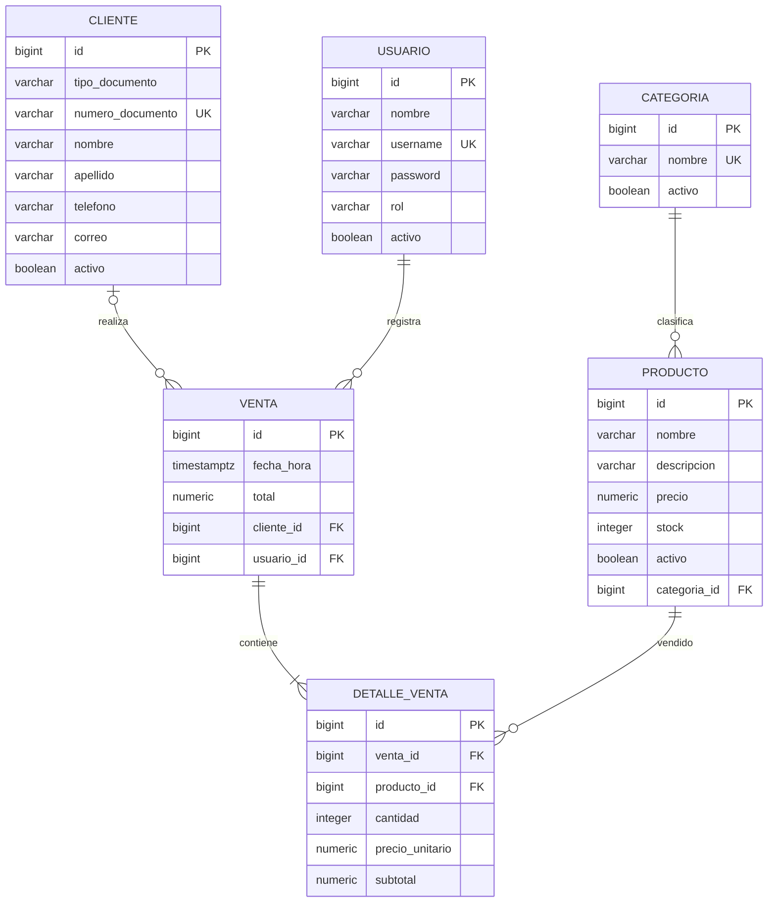
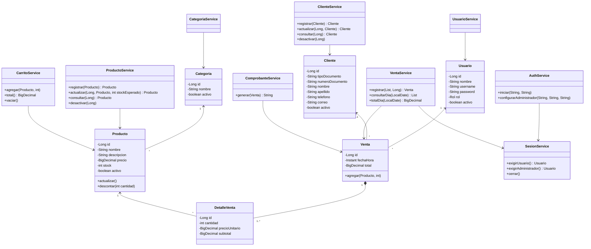
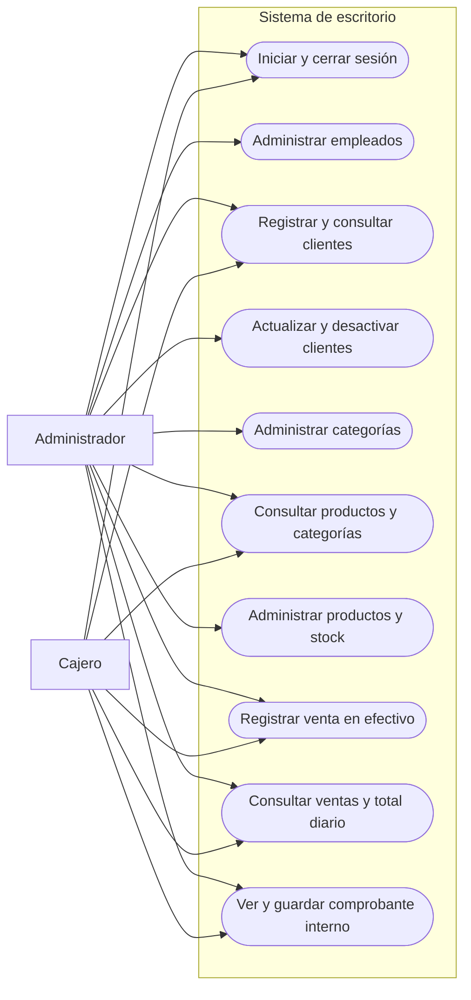

# Diseño previo a la implementación

## Arquitectura

Paquetes: `config`, `controller`, `model`, `repository`, `service`, `exception`, `util`. Sin controladores HTTP. El controlador presenta formularios, recoge entradas y delega. Un ejecutor de tareas ejecuta los servicios fuera del hilo JavaFX. Los resultados regresan al hilo gráfico. El contexto Spring se inicia al abrir la aplicación y se cierra al salir.

## Modelo entidad-relación

Se crean exclusivamente las seis tablas solicitadas. IDs `BIGINT GENERATED BY DEFAULT AS IDENTITY`. Dinero `NUMERIC(14,2)` y `BigDecimal`; total/subtotal > 0, cantidad > 0, precio > 0, stock >= 0. Claves foráneas conservan el historial. Índices en fecha de venta y claves foráneas. Índice único en `lower(nombre)` para categorías. El detalle no repite un producto dentro de la misma venta.

La fecha se persiste como instante con zona y se consulta por intervalo [inicio del día, inicio del día siguiente) calculado para America/Bogota. El nombre actual de un cliente/producto se utiliza al reabrir comprobantes; los importes se leen del detalle histórico. No se añade almacenamiento de copias de nombres, porque no lo exige el modelo solicitado.

## Diagrama de clases principales

Los seis repositorios extienden `JpaRepository` y se inyectan en los servicios correspondientes. No hay jerarquía artificial de entidades ni repositorio genérico propio. La composición Venta/DetalleVenta representa el agregado transaccional. Una línea de carrito tiene producto, cantidad y precio cotizado: es un valor transitorio necesario para confirmar exactamente lo presentado.

## Diagrama de casos de uso

Se incluye además el fuente PlantUML de casos de uso para una representación UML con actores y límite del sistema.

## Secuencia de venta

1. El servicio comprueba sesión activa, cliente opcional y líneas del carrito.
2. Ordena los IDs de producto y adquiere bloqueos de escritura en la transacción.
3. Comprueba producto activo, cantidad, stock y coincidencia del precio cotizado.
4. Crea los detalles con sus precios unitarios y subtotales, acumula total y descuenta stock.
5. Persiste el agregado y confirma la transacción. Una excepción revierte todos los cambios.
6. Tras confirmación, vacía el carrito y presenta el comprobante. Un fallo posterior al guardar el comprobante no repite la venta; esta se recupera en consultas.
